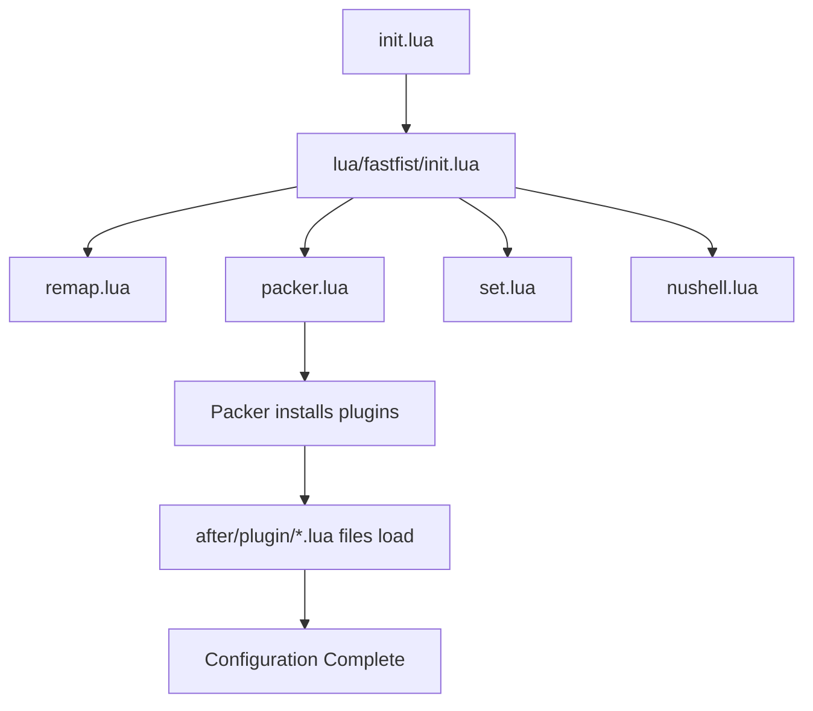

This Neovim configuration is organized using a modular structure that leverages Lua for all configuration files. The setup follows Neovim's standard configuration conventions while maintaining a clean and logical organization.

## Configuration Structure

The configuration is divided into three main directories:

<CardGroup cols={3}>
  <Card title="init.lua" icon="file-code" href="#init-lua">
    Entry point that loads all modules
  </Card>
  <Card title="lua/fastfist/" icon="folder" href="#lua-directory">
    Core configuration modules
  </Card>
  <Card title="after/plugin/" icon="puzzle-piece" href="#after-plugin-directory">
    Plugin-specific configurations
  </Card>
</CardGroup>

## init.lua

The root `init.lua` file is the entry point for the entire configuration. It simply loads the `fastfist` module:

```lua init.lua
require("fastfist")
```

This minimal entry point keeps the root configuration clean while delegating all actual configuration to the module system.

## lua/ Directory

The `lua/fastfist/` directory contains the core configuration modules that are loaded before plugins are initialized:

### lua/fastfist/init.lua

The main initialization file that orchestrates loading of all configuration modules:

```lua lua/fastfist/init.lua
require("fastfist.remap")
require("fastfist.packer")
require("fastfist.set")
require("fastfist.nushell").setup()

local augroup = vim.api.nvim_create_augroup
local autocmd = vim.api.nvim_create_autocmd
local yank_group = augroup('HighlightYank', {})

function R(name)
    require("plenary.reload").reload_module(name)
end

autocmd('TextYankPost', {
    group = yank_group,
    pattern = '*',
    callback = function()
        vim.highlight.on_yank({
            higroup = 'IncSearch',
            timeout = 40,
        })
    end,
})
```

<AccordionGroup>
  <Accordion title="Module Loading Order">
    1. **remap.lua** - Loads all keybindings first
    2. **packer.lua** - Initializes the plugin manager and plugin list
    3. **set.lua** - Configures Vim options and settings
    4. **nushell** - Sets up Nushell-specific configuration
  </Accordion>
  
  <Accordion title="Autocommands">
    The init file also sets up autocommands:
    - **HighlightYank**: Briefly highlights yanked text for visual feedback
    - **R() function**: Utility function for reloading modules during development
  </Accordion>
</AccordionGroup>

### Module Descriptions

<CardGroup cols={2}>
  <Card title="remap.lua" icon="keyboard" href="/configuration/keybindings">
    Global keybindings and leader key configuration
  </Card>
  <Card title="set.lua" icon="sliders" href="/configuration/settings">
    Vim options, UI settings, and editor behavior
  </Card>
  <Card title="packer.lua" icon="box" href="/configuration/plugins">
    Plugin manager setup and plugin declarations
  </Card>
</CardGroup>

## after/plugin/ Directory

The `after/plugin/` directory contains plugin-specific configurations that are loaded **after** plugins are initialized. This directory follows Neovim's convention where files here are automatically sourced after plugin loading.

<Info>
The `after/plugin/` pattern is a Neovim convention that ensures plugin configurations run after the plugins themselves are loaded, preventing initialization order issues.
</Info>

### Plugin Configuration Files

<AccordionGroup>
  <Accordion title="LSP & Completion" icon="code">
    - **lsp.lua** - LSP server configurations, keybindings, and completion setup
    - Configures Mason, LSP servers, and nvim-cmp
  </Accordion>
  
  <Accordion title="Navigation & Search" icon="magnifying-glass">
    - **telescope.lua** - Fuzzy finder keybindings
    - **harpoon.lua** - Quick file navigation setup
    - **neo-tree.lua** - File explorer configuration
  </Accordion>
  
  <Accordion title="Git Integration" icon="git">
    - **neogit.lua** - Git interface setup and keybindings
    - **blamer.lua** - Git blame display configuration
  </Accordion>
  
  <Accordion title="UI & Appearance" icon="palette">
    - **colors.lua** - Colorscheme configuration
    - **lualine.lua** - Status line setup
    - **indent-blankline.lua** - Indentation guides
    - **zenmode.lua** - Distraction-free writing mode
  </Accordion>
  
  <Accordion title="Editing & Syntax" icon="file-code">
    - **treesitter.lua** - Syntax highlighting and parsing
    - **undotree.lua** - Undo history visualization
  </Accordion>
</AccordionGroup>

## Configuration Loading Flow



<Steps>
  <Step title="Entry Point">
    `init.lua` requires the fastfist module
  </Step>
  <Step title="Core Module Loading">
    `lua/fastfist/init.lua` loads keybindings, settings, and plugin definitions
  </Step>
  <Step title="Plugin Installation">
    Packer ensures all plugins are installed
  </Step>
  <Step title="Plugin Configuration">
    Files in `after/plugin/` configure each plugin with keybindings and options
  </Step>
</Steps>

## Customization Guidelines

<Warning>
When modifying the configuration, maintain the loading order to prevent initialization issues.
</Warning>

### Adding New Keybindings

- **Global keybindings**: Add to `lua/fastfist/remap.lua`
- **Plugin-specific keybindings**: Add to the corresponding file in `after/plugin/`

### Adding New Plugins

1. Add the plugin to `lua/fastfist/packer.lua`
2. Create a configuration file in `after/plugin/` if needed
3. Run `:PackerSync` to install

### Modifying Settings

Edit `lua/fastfist/set.lua` for any `vim.opt` or editor behavior changes.

## Next Steps

<CardGroup cols={2}>
  <Card title="Keybindings" icon="keyboard" href="/configuration/keybindings">
    Explore all available keybindings
  </Card>
  <Card title="Settings" icon="sliders" href="/configuration/settings">
    Learn about editor settings and options
  </Card>
  <Card title="Plugins" icon="puzzle-piece" href="/configuration/plugins">
    Discover installed plugins and their configurations
  </Card>
</CardGroup>